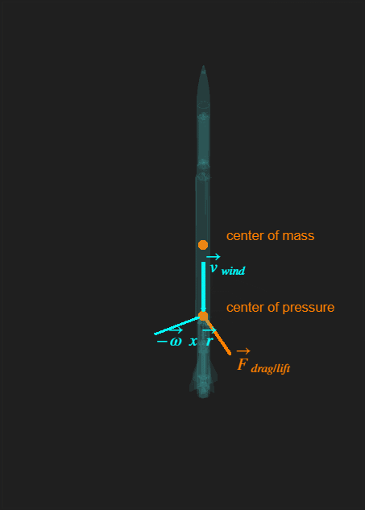
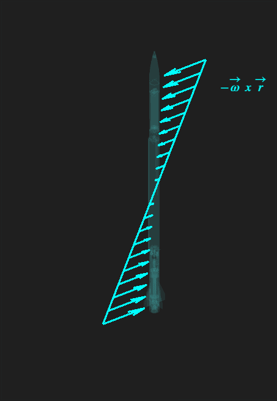

# Aerodynamics model

Author: Vilgot Lötberg

<h2>Background</h2>

This paper will treat the modelling of the aerodynamic moments around a flying body. The method described takes into account the geometry of the body and the non-linearity of lifting moments distributed along its sides, though it does not take into account any fluid-mechanics interaction between different surfaces, nor the differences between supersonic and subsonic airflow.

The model is primarily intendet to be used in conjunction with the equations of motion to simulate rocketry/aircraft control/aerodynamic behavior in flight.

<h2>Introduction</h2>

A common way to describe aerodynamic bodies is to use the 'center of pressure' -approach, where all the aerodymamic forces are assumed to act from a single point on the body.

While useful to get an overview of the bodys aerodynamic tendencies, such as whether or not its stable in flight, it is not very accurate when it comes to describing the actual aerodynamic behaviour of the body.

To understand why, intuition must be gained about the non-linear nature of the moment generated by the aerodynamic force. In the example above, the moment resulting from the aerodynamic force would simply be modelled as:

$$ \vec{M} = \vec{r} \times \vec{F} $$

However, by instead considering the infitesimal area-elements along the bodys broadside, and considering the pressure applied to each in its normal direction from, for example, the rockets rotation, it paints a different picture. Assuming no relative velocity, and looking only at the contribution from the body's own rotation, the velocity distribution along its side becomes the following:

Consider now the simplified equation of drag/lift as given by Nasa*:

$$F = \frac{1}{2} \;\rho \; C_{d/l} \;A \; v^2$$

(*The equation cannot be used as is in a vectorized context, as it maps both positive and negative velocities to a positive force. A sign-term must be added in order to map velocities to a force in the same corresponding direction, i.e a positive velocity to a positive force, and a negative velocity to a negative force):

$$ F = \frac{1}{2} \;\rho \; C_{d/l} \;A \; v^2 \; \text{sign}(v)$$

Considering an infitesimal area segment along the bodys broadside:

The force distributed along the broadside as

$$\partial F = \frac{1}{2} \;\rho \; C_{d/l} \;\partial A \; v^2 \; \text{sign}(v)$$

thus looks like this:

This results in the total moment from all the $\partial F$ contributions being much larger than that which would result from assuming a center-of-pressure, and this will be proven mathematically later in the paper. What follows is to setup a more accurate model that can be used to calculate the moment resulting from the $\partial F$ contributions along the body. Initially this model will only be describing the moment in a single direction, though it will later be expanded to a vectorized context.

<h2>Methodology</h2>

