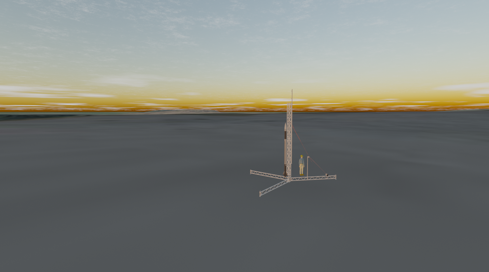

# Creating and modelling rockets
Author: Vilgot Lötberg, vilgotl@kth.se, 0725079097



<h2>Contents:</h2>

- Understanding how the main script and the other high level scripts work
- Understanding the rocket-structure
    - Coordinate-systems and basis
- Understanding models and ODE-structure on a high level
    - Understanding models and ODE-structure on a lower level


**NOTE!**
In this article, the words struct, structure and object are used interchangably to refer to the same thing.


<h2>Understanding how the main script and the other high level scripts work</h2>


<h2>Understanding the rocket-structure</h2>

[NOTE!] This is not a comprehensive guide to what fields are contained in the rocket-struct at any given instance, as this is an ever changing code-base. This is simply meant as a guide to navigating the rocket-structure. To get a detailed view of what fields and parameters are contained in a given rocket, the instructions below describe how to obtain that information.

Creating a new rocket using this codebase requires a basic understanding of how, and why the codebase is structured. Typing into the MATLAB command-line interface (the reader is encouraged to type along):

```
>> setup

>> my_rocket = mjollnir

my_rocket = 

  struct with fields:

                name: "Mjöllnir"
         dont_record: [""    ""]
              models: {[@propulsion_model]  [@aerodynamics_model]  [@gravity_model]}
     state_variables: {["attitude"]  ["angular_momentum"]  ["position"]  ["velocity"]}
          enviroment: [1×1 struct]
          rigid_body: [1×1 struct]
              forces: [1×1 struct]
             moments: [1×1 struct]
            attitude: [3×3 double]
    angular_momentum: [3×1 double]
       rotation_rate: [3×1 double]
            position: [3×1 double]
            velocity: [3×1 double]
                mass: 80
        length_scale: 4
                mesh: "Assets/AM_00 Mjollnir Full CAD v79 low_poly 0.03.stl"
        aerodynamics: [1×1 struct]
              engine: [1×1 struct]

```


This is the basic jist of it. The rocket is sorted into a hierarchy of structures (MATLAB struct, see https://se.mathworks.com/help/matlab/ref/struct.html). The reason for this is to make naming of variables easy, and improving code understandability. For example, when accessing a rocket parameter, say the orientation of the nozzle, one could index into the ``engine`` struct shown above as a field under ``my_rocket``, to see more closely what fields it has:

```
>> my_rocket.engine

ans = 

  struct with fields:

       burn_time: 20
    thrust_force: 4000
        position: [3×1 double]
        attitude: [3×3 double]
          nozzle: [1×1 struct]
```

Here one can see that the rocket contains a field called ``nozzle``:

```
>> my_rocket.engine.nozzle

ans = 

  struct with fields:

    position: [3×1 double]
    attitude: [3×3 double]

```

And bingo, the parameter describing the orientation of the nozzle has been found, namely ``attitude``:

```
>> my_attitude = my_rocket.engine.nozzle.attitude

my_attitude =

     1     0     0
     0     1     0
     0     0     1

```


Notice that if the line ``rocket.engine.nozzle.attitude`` was to appear in code, figuring out what property of the rocket it was reffering to and what was being calculated would be quite easy to figure out. Following this structure makes the code relatively self documenting, making it easy to backtrack and figure out what does what.

<h3>Coordinate-systems and basis</h3>
<h4>Summary:</h4> 
In general, coordinate systems follow this pattern:

**All an objects properties are in the objects parents basis!**
If the parent has no specified basis, it inherets the basis of its next successive parent.


<h4>Extended:</h4>

In general when working with properties that are vectorized, they are ment to be interpreted as though they are in a certain basis. For example, properties like the rockets position: ``rocket.position `` are written in the worlds basis, i.e:

```
>> my_rocket.position

ans =

     0
     0
   990
```

means that the rocket is at z=900 relative to origin.

However, reading a property such as center of mass:


```
>> my_rocket.rigid_body.center_of_mass

ans =

         0
         0
    0.5000
```

This property is not defined relative to the world-basis, and is instead defined relative to the rockets internal coordinate system.


In general, coordinate systems follow this pattern:

**All an objects properties are in the objects parents basis!**

For all properties under ``rocket``, like ``rocket.position``, they will be in the rockets's parents basis, ie the world. For properties under ``rocket.rigid_body``, they will be in the ``rocket.rigid_body``'s parent's basis, ie ``rocket``. 

For example ``rocket.rigid_body.center_of_mass`` will be in the basis of ``rocket``.

What this basis acually is is ALWAYS described by the property ``attitude``, whether it be ``rocket.attitude``, ``rocket.engine.nozzle.attitude``, or ``rocket.fins.attitude``, this 3x3 matrix describes the basis vectors of it's parent object.